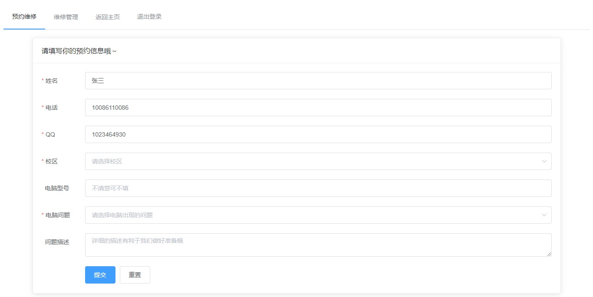

# 先锋网络中心维修预约管理系统（开发中）
## 使用须知
### 数据库配置
需要在resources目录下新建database.properties配置文件  
文件格式如下  
```properties
address = 127.0.0.1:8080 (数据库IP地址:端口)
user = root (数据库用户名)
password = 123123 （数据库密码）
```
## 计划功能
1. 登录预约：登录验证、时间位置预约  
2. 预约管理：状态管理、维修备注  
3. 预约数量限制
4. 先锋网络中心信息展示
5. 维修教程  
## 目前存在问题
1. 只能记录预约时间，地点没有记录；  

## 目前界面


